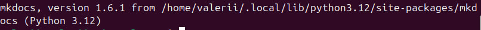
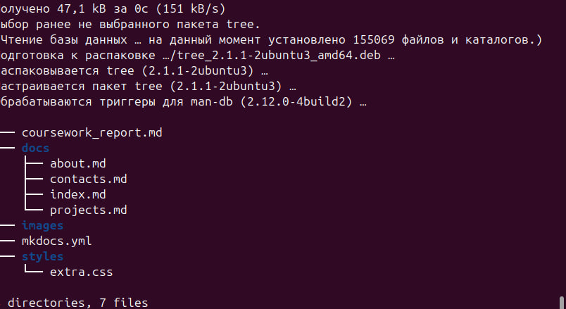
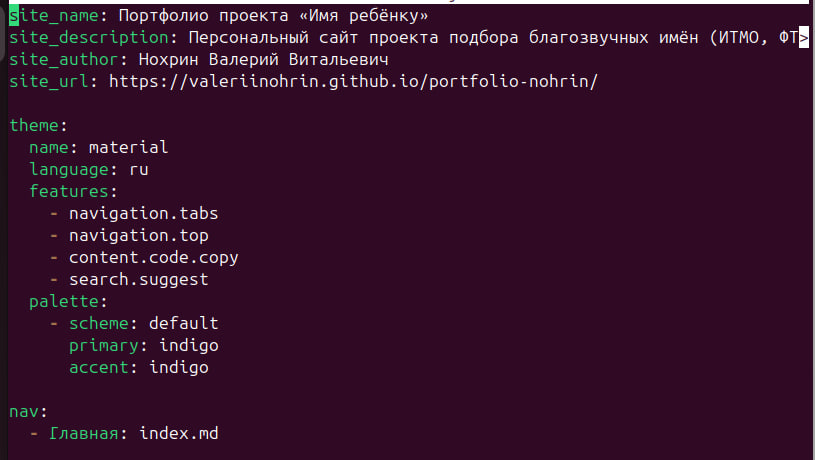
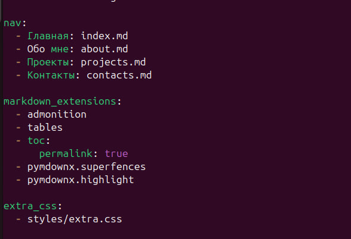
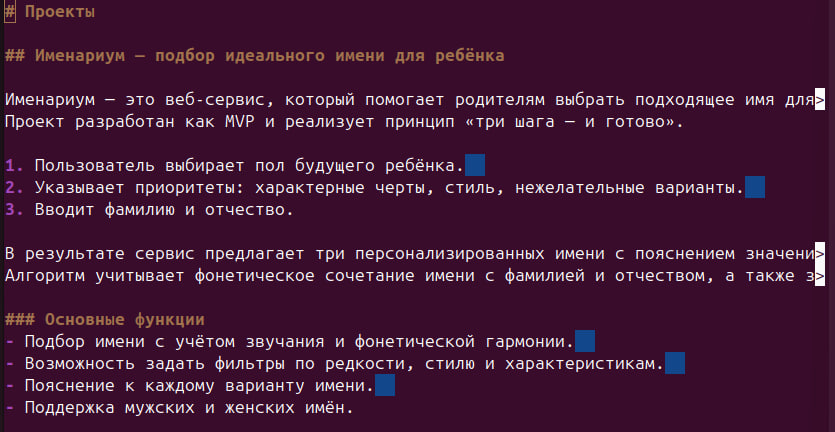
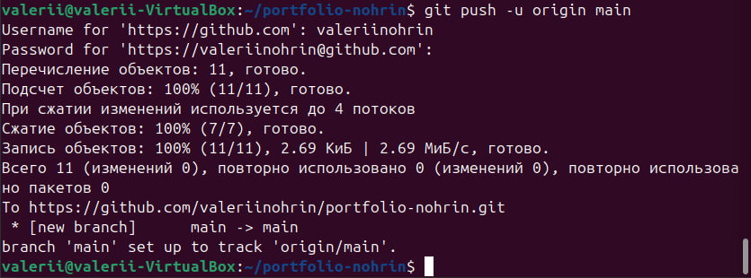
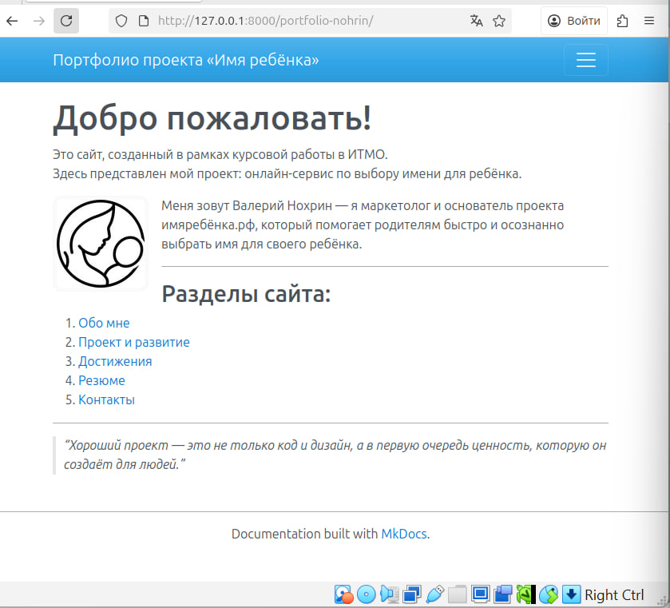
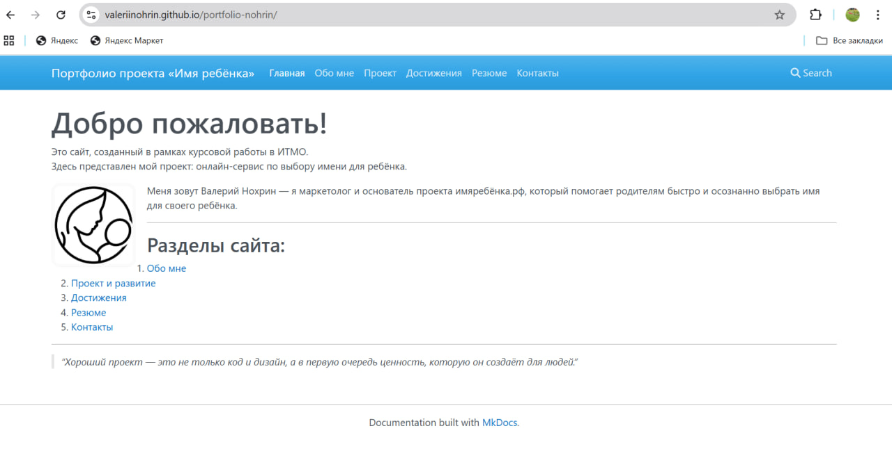

Курсовая работа
по дисциплине: Введение в веб-технологии (ИТМО)
Тема: Создание персонального сайта с использованием MkDocs
Автор: Нохрин Валерий Витальевич
Группа: U4225
Год: 2025
Дата начала: 13.10.2025
Дата завершения: 16.10.2025

## 1. Установка Python и MkDocs

Установил Python и пакет MkDocs. Проверил корректность установки командой:
mkdocs --version

Система вывела версию MkDocs и Python 3.12.

---

## 2. Создание проекта

Создал новый проект `portfolio-nohrin`.  
Структура проекта включает каталоги `docs/` и `styles/`, а также файл `mkdocs.yml`.

---

## 3. Настройка конфигурации

В файле `mkdocs.yml` указал:
- название и описание сайта,
- автора,
- язык интерфейса,
- подключение кастомного CSS-файла.

Настроил навигацию и подключил расширения Markdown.

---

## 4. Наполнение контента

Добавил страницы:
- `index.md` — главная,
- `about_me.md` — обо мне,
- `projects.md` — описание проекта «Имя ребёнка»,
- `achivments.md` — достижения,
- `resume.md` — резюме,
- `contacts.md` — контакты.

Каждая страница оформлена в Markdown и содержит заголовки, списки, изображения и ссылки.

---

## 5. Кастомизация стилей

Подключил файл `docs/styles/site.v3.css`.  
Настроил цвета, типографику/
Также сделал название сайта некликабельным.

---

## 6. Локальное тестирование

Для проверки работы сайта использовал команду:
mkdocs serve

Сайт открылся по адресу `http://127.0.0.1:8000/`.  
Проверил корректность отображения всех страниц и навигации.

---

## 7. Публикация на GitHub Pages

Развернул сайт на GitHub Pages командой:
mkdocs gh-deploy --force

Проект опубликован по адресу:  
https://valeriinohrin.github.io/portfolio-nohrin/

---

## Отказ от реализации светлой и тёмной тем

На этапе настройки темы я рассматривал возможность добавить переключение между светлой и тёмной версиями оформления. В MkDocs (Material) это делается через раздел palette в конфигурации mkdocs.yml.

Однако при тестировании я заметил, что на моём фронте тёмная тема отображалась некорректно:

часть текста сливалась с фоном;
изменялись цвета ссылок и кнопок;
кастомные стили из файла site.v3.css не адаптировались под тёмную палитру.

Из-за этого общий вид сайта становился неаккуратным, а элементы — плохо читаемыми. Я решил оставить одну стабильную цветовую схему — светлую, с белым фоном и контрастными заголовками.

Такой вариант оказался визуально чище и надёжнее: все страницы отображаются одинаково и не зависят от системных настроек темы у пользователя.

## Результат

Создан персональный сайт-портфолио на MkDocs с шестью страницами, навигацией, пользовательскими стилями и публикацией через GitHub Pages.  
Все требования курсовой работы выполнены.

